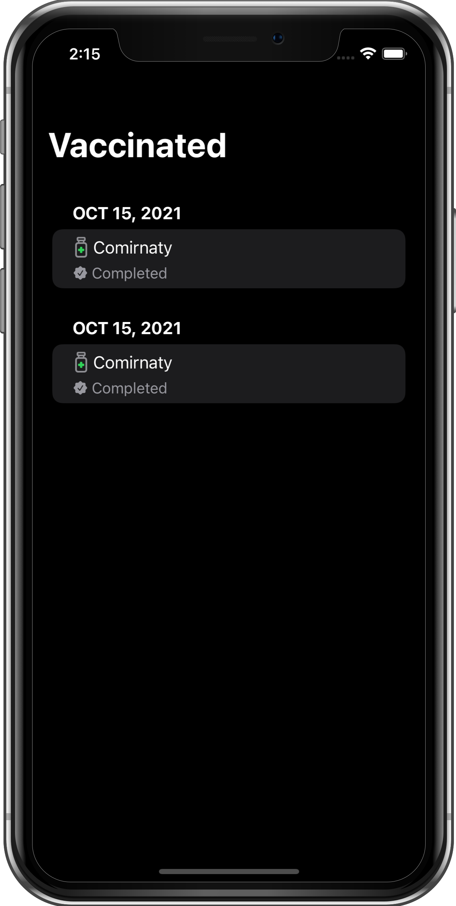

# SwiftUIVaccine

This application uses `HealthKit` to retrieve immunizations records, [FHIRModels](https://github.com/apple/FHIRModels) for `FHIR` resource data models. Using Canadian Vaccine Catalogue `Tradename COVID-19 vaccine codes`.

